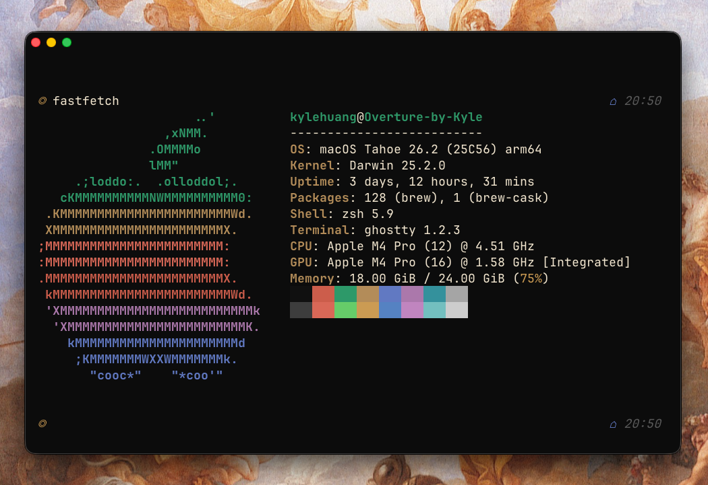

## Cole for Ghostty

Ghostty theme file that contains the Cole colorscheme.



### Installation

On MacOS, navigate to `~/.config/ghostty/themes` and create a new file called `Cole` with no file extension. Paste the contents of the colorscheme file in this folder into `Cole` and save it. Finally, paste this line to the bottom of `~/.config/ghostty/config`:

```
theme = Cole
```

Restart Ghostty and Cole should be applied.
